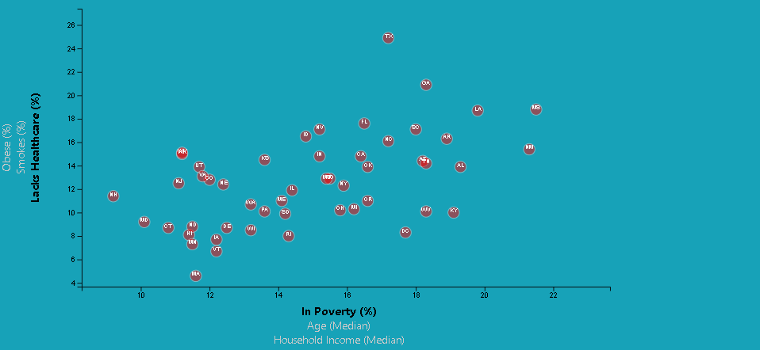

# Unit 16 | Assignment - Data Journalism and D3

## Background

Welcome to the newsroom! This challenge is about a data visualization position for a major metro paper. The task is with analyzing the current trends shaping people's lives, as well as creating charts, graphs, and interactive elements to help readers understand my findings.

The editor wants to run a series of feature stories about the health risks facing particular demographics. She's counting on me to sniff out the first story idea by sifting through information from the U.S. Census Bureau and the Behavioral Risk Factor Surveillance System.

The data set included with the assignment is based on 2014 ACS 1-year estimates: [https://factfinder.census.gov/faces/nav/jsf/pages/searchresults.xhtml](https://factfinder.census.gov/faces/nav/jsf/pages/searchresults.xhtml). The current data set incldes data on rates of income, obesity, poverty, etc. by state. MOE stands for "margin of error."

## Task

### Level 1: D3 Dabbler

- - -

### Level 2: Impress the Boss (Optional Challenge Assignment)

Why make a static graphic when D3 lets you interact with your data?

#### 1. More Data, More Dynamics and also d3-tip.

## Copyright

Data Boot Camp © 2018. All Rights Reserved.
